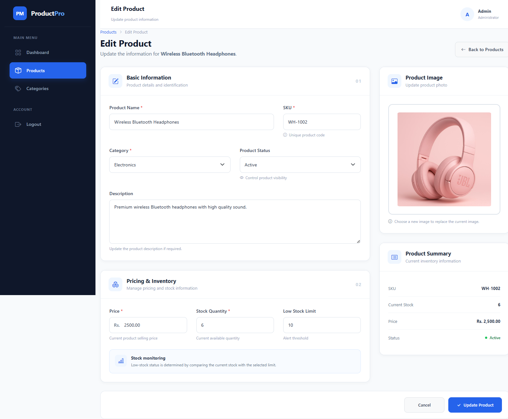

# Product Management System

A full-stack product and inventory management system built with PHP and MySQL. Admins can securely manage products and categories, track stock levels, upload product images, search and filter inventory, and export product data as CSV.

## Features

* **Secure admin login** — registration and login with password hashing and session-based authentication
* **Product management (CRUD)** — add, edit, delete, and manage products with server-side validation
* **Category management** — create, edit, and delete product categories
* **Stock management** — track product stock and identify low-stock products
* **Dashboard** — view total products, categories, stock, and low-stock statistics
* **Product search & filtering** — search products and filter by category, status, and stock
* **Product image upload** — upload and manage product images
* **CSV export** — export product information as a CSV file
* **Responsive design** — clean interface that works across different screen sizes

## Built with

* PHP
* MySQL
* HTML
* CSS
* JavaScript

## Screenshots

### Login & Register

### Dashboard

### Products

### Add & Edit Product

### Categories

## Setup

1. Install [XAMPP](https://www.apachefriends.org/) and start Apache + MySQL
2. Copy this project folder into `htdocs`
3. Open `http://localhost/phpmyadmin`
4. Create a database named `product_management`
5. Configure `config/database.php` with your local MySQL username and password
6. Visit `http://localhost/product-management/`
7. Register an admin account and log in

## Notes

This is a student project built to practice full-stack web development using PHP and MySQL. It demonstrates product management, category management, inventory tracking, authentication, image uploads, filtering, and CSV export.
